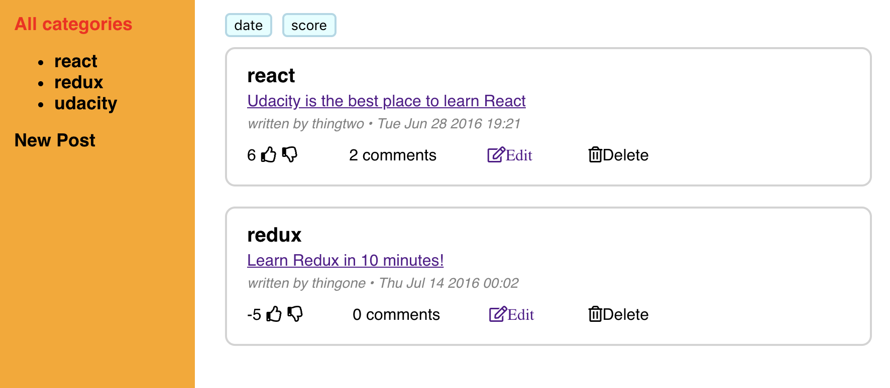
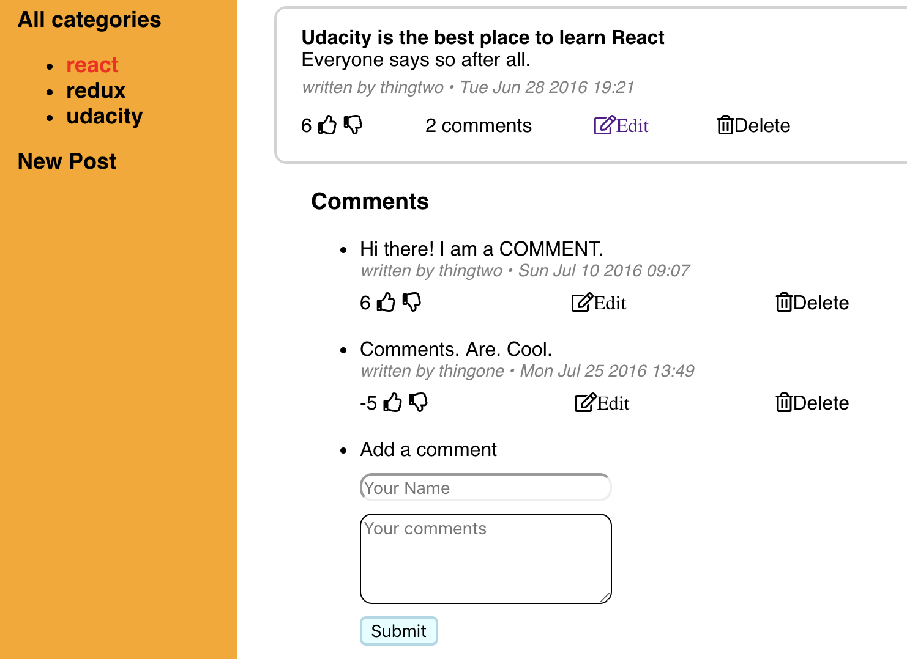
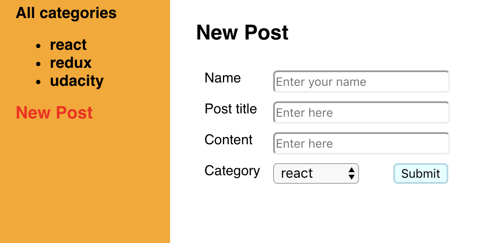

# Readable Project

- Readable Project is a content and comment web app, built with ReactJS.

## App Functionality

Users will be able to

- post content to predefined categories
- comment on their posts and other users' posts
- vote on posts and comments
- edit and delete posts and comments

### Posts

### Post Details

### New Post

## Installation Instructions

1.API Server

- cd reactnd-project-readable-starter/api-server
- git clone https://github.com/udacity/reactnd-project-readable-starter.git
- npm install
- node server

2.App

- git clone https://github.com/mavisluan/readable.git
- cd Readable_project
- npm install
- npm start
